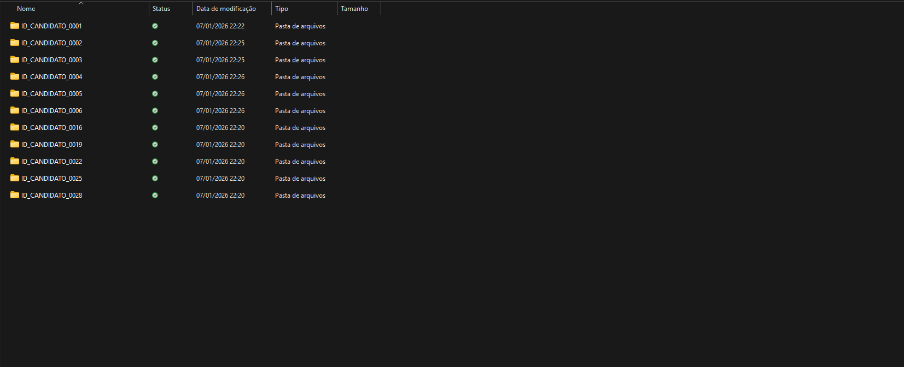

# Academic Enrollment Folder Organizer

Script em Python para automatizar a organização de pastas de candidatos com base em informações contidas em arquivos HTML institucionais.

O projeto foi desenvolvido para resolver um problema real de organização de documentos acadêmicos na UNIVERSIDADE FEDEREAL FLUMINENSE (UFF), envolvendo grande volume de dados, regras condicionais e tratamento de inconsistências nos arquivos de entrada.


---

## 📌 Problema

Cada candidato possui uma pasta identificada inicialmente por um código numérico.  
Dentro da pasta há documentos e um arquivo `index.html` contendo:

- Nome do candidato
- Curso
- Município
- Resultado final (APTO / INAPTO / ELIMINADO)

O trabalho manual consistia em:
- Abrir cada `index.html`
- Ler as informações
- Renomear a pasta seguindo um padrão específico
- Separar candidatos eliminados

Esse processo era repetitivo, demorado e sujeito a erro humano.

---

## ✅ Solução

O script automatiza todo o processo:

- Percorre todas as pastas de candidatos
- Lê e interpreta o `index.html`
- Renomeia automaticamente pastas de candidatos **APTOS**
- Move candidatos **ELIMINADOS** para uma pasta separada
- Ignora pastas já organizadas
- Tolera ausência de `index.html`
- Trata arquivos com encoding inconsistente (UTF-8 / Latin-1)

O script é **seguro**, **idempotente** e pode ser executado múltiplas vezes sem efeitos colaterais.

---

## 🧠 Funcionalidades principais

- Parsing de HTML com BeautifulSoup
- Automação de sistema de arquivos
- Tratamento de exceções e dados inconsistentes
- Separação clara de regras de negócio
- Execução protegida com `if __name__ == "__main__"`

---

## 📁 Estrutura do projeto

academic-enrollment-folder-organizer/
├── organizar_ingressantes.py
├── requirements.txt
├── README.md
└── CAMINHO_DA_PASTA_BASE/
    └── exemplos/
        ├── Pasta_Aptos/
        └── _ELIMINADOS/


> Os dados presentes na pasta `exemplos` são **totalmente fictícios** e não representam informações reais.

---

## 🔧 Como usar

1. Instale as dependências:
```bash
-pip install -r requirements.txt

2. Configure o caminho da pasta base no script:

-PASTA_BASE = r"CAMINHO_DA_PASTA_BASE"


3. Execute:

-python organizar_ingressantes.py


---

##🔒 Privacidade e dados sensíveis

-Por motivos de privacidade e conformidade com a LGPD:

-Nenhum dado real foi incluído neste repositório

-Os arquivos HTML e nomes de pastas são fictícios

-O projeto demonstra apenas a lógica da automação


---

## 📺 Demonstração

### Vídeo
Veja o script em ação organizando 30 pastas de candidatos:


*Ou acesse: [Link do vídeo](demo/video_demo.mp4)*

### Screenshots
| Antes | Depois (Aptos) | Inaptos |
|-------|----------------|---------|
|  |  |  |

## 🧪 Testando o projeto

Os dados de demonstração estão disponíveis em `/demo/candidatos_demo/` com informações fictícias para testes.
---


## 📄 Licença

Este projeto está licenciado sob a licença MIT.
Uso educacional e demonstrativo.
